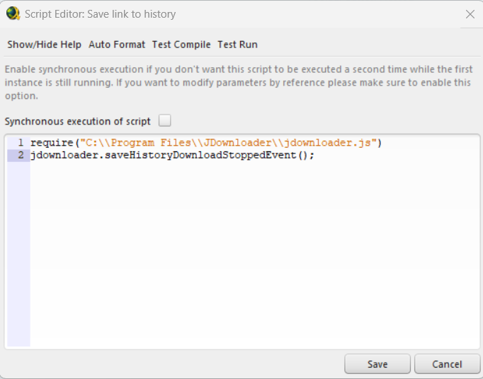
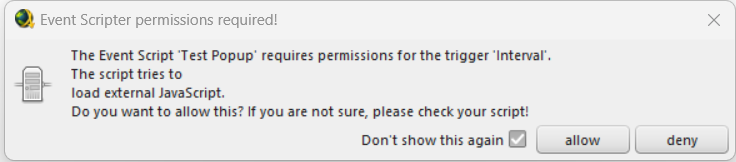

# jdownloader-typescript
*Starter package for developing EventScripter scripts for JDownloader*


Are you a fan of JDownloader 2? Have you ever wanted to add your own functionality? Do you find the small built-in script editor to be difficult to use? Then this starter package might be for you!

**Benefits**
- Use your favorite editor
- Reuse scripts or libraries
- All built-in functions are typed with Typescript

## What is JDownloader?
[JDownloader](https://jdownloader.org/) is a powerful application for managing downloads. It supports finding files and media on hundreds of websites through built-in plugins. It also supports user scripts through an extension called [Event Scripter](https://support.jdownloader.org/Knowledgebase/Article/View/what-is-the-event-scripter/21). As the name implies, event scripter can trigger Javascript when certain events occur (e.g. download finished). This starter package makes the process of creating scripts easier.

## How to use

### Prerequisites 
- A text editor or IDE like [Visual Studio Code](https://code.visualstudio.com/)
- [NodeJS](https://nodejs.dev/)
- Knowledge of [Typescript](https://www.typescriptlang.org/) or JavaScript
- [JDownloader](https://jdownloader.org/)

### Getting Started
The easiest way to get started is to [download the code as a ZIP file](https://github.com/matthewmmorrow/jdownloader-typescript/archive/refs/heads/main.zip). You can alternatively use git or fork this repository.

Once downloaded and extracted, open a command prompt in the directory. Install all the node modules, including typescript and webpack by running the command:
```
npm install
```

### Writing scripts
All the code can be found in the `src` directory with the main entry point being the `index.ts` file. To build a Javascript file of all the code, run the command:
```
npm run build
```

This will create a single file called `jdownloader.js` in the `dist` directory. 

### Adding scripts to JDownloader
In JDownloader, in the `Settings` tab, select the `Event Scripter` item from the left menu. If this item is not visible it may need to be installed in `Extension Modules`.

Click `Add` to create a new event script. Give it a name and choose the appropriate trigger. Then click `Edit`. 

To include the built scripts, the first line of the script will use the `require(string)` function to load the file from disk. One tip is to copy the built script to the JDownloader directory, but referencing the file directly from the project `dist` directory would also work. On Windows, the command `npm run copy-dist-win` will copy the output file to the JDownloader directory.

Additional lines in the script can reference functions fro the built scripts which will be under the `jdownloader` global object.

Altogher it might look like this:
```
require("C:\\Program Files\\JDownloader\\jdownloader.js")
jdownloader.saveHistoryDownloadStoppedEvent();
```



*Note: if you are using Windows which uses "\\" characters in paths, they must be doubled.*

The first time the script runs, a prompt asking for permission to execute the local file may display. Click `allow` go give access after verifying the script is correct. There may be 2 boxes. If the script is marked a "synchronous" then JDownloader may lock up so it is recommended to run the script once with the check box unchecked.


## Examples and Reference
### Included files
Some files included in this repository are examples and some are necessary for proper typing.

- `index.ts` - Main entry point for all scripts. Code can be written here or imported from other modules. Export any functions which should be accessible from the `jdownloader` global object in the event scripter.
- `jdownloader.d.ts` - Strongly-typed global functions provided to event scripter. Not all functions are available to all trigger types.
- `eventTriggers.ts` - Strongly-typed trigger event property object. See section on `getEventTriggerProperties`
- `prioritizePackages.ts` - Example of a button trigger `prioritizePackagesButtonEvent` and interval trigger `prioritizePackagesIntervalEvent` which execute the same function to prioritize packages with smaller unfinished links.
- `saveHistory.ts` - Example of a context menu trigger `saveHistoryContextMenuEvent` and download stopped trigger `saveHistoryDownloadStoppedEvent` which use the same function to save links to history files based on hoster.
- `markDuplicates.ts` - Example of a new linke added trigger `markDuplicatesNewLinkEvent` which uses the output from the save history events to add comments and disable added links which were already downloaded.

### Different event trigger types - `getEventTriggerProperties`
Since different event trigger types have different configurable options and properties, there needs to be a way to get the correct properties in a strongly-typed manner. This is done with a call to `getEventTriggerProperties` which takes the expected property type. This returns the global trigger properties in a single typed object. The list of types can be found in `eventTriggers.ts`

For example this code expects to be called as a toolbar button pressed trigger and tries to get the corresponding properites. If no object is return, the correct properties failed. Finally, it tries to use the `name` property from the toolbar button pressed trigger event properties.
```
const eventTriggerProps = getEventTriggerProperties(ToolbarButtonPressedEventTriggerProperties);
if(!eventTriggerProps) return;

//Check preconditions
if(eventTriggerProps.name != "Prioritize Packages") return;

//Do action
```

### Typescript and Webpack
Event Scripter only supports ES5 and no modules. The files are not built with `tsc` but instead are built with Webpack.

Currently all files are built in to a single output file. While this is convenient for development it might not be performant at large scale since the entire file is reloaded every trigger. This can possibly be extended in the `webpack.config.js` to allow multiple entry points and multiple output files for smaller, targeted files.

## Development
If you would like to make any submissions, pull requests are welcome and will be reviewed as time allows. Please keep submissions to improvements on the base starter packages and not specific event scripts you created.